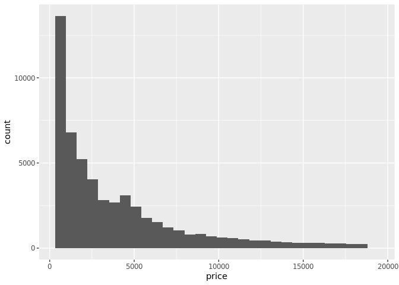
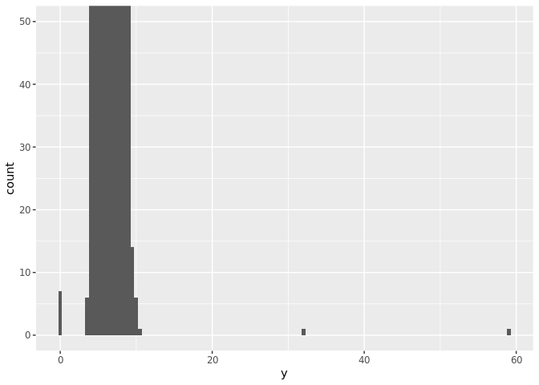
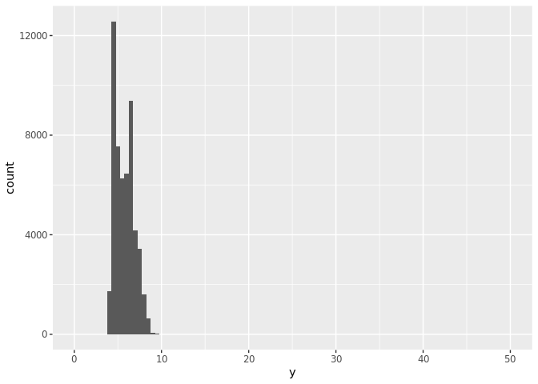
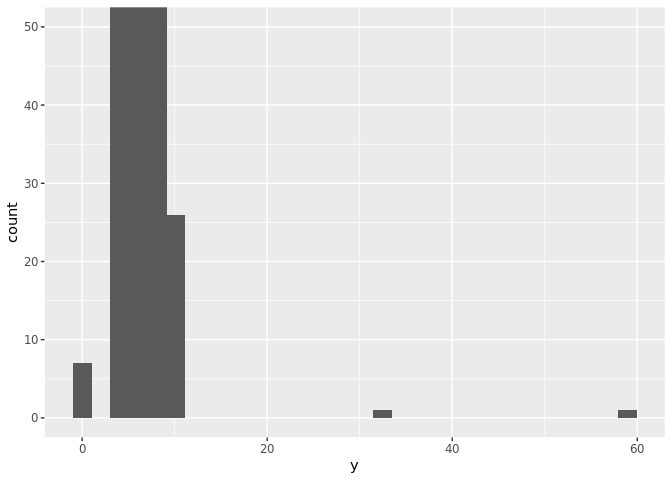
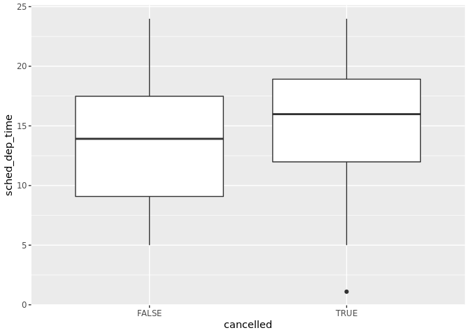
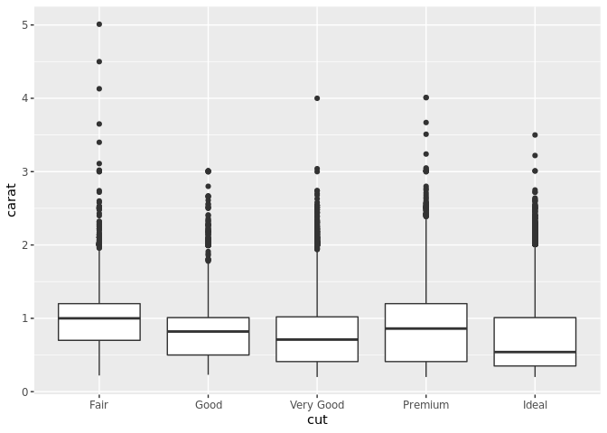
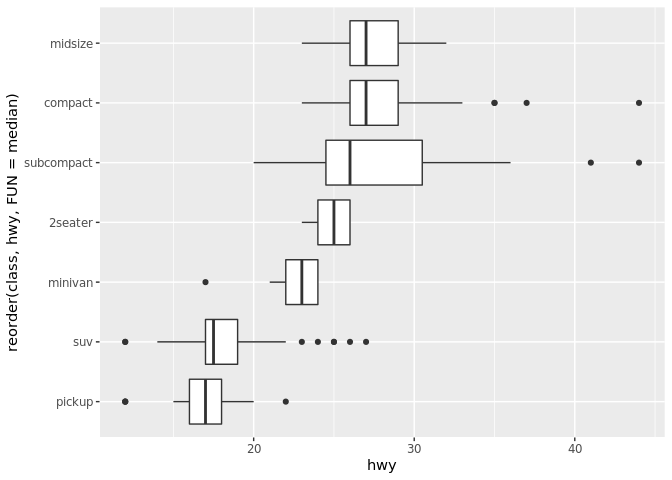
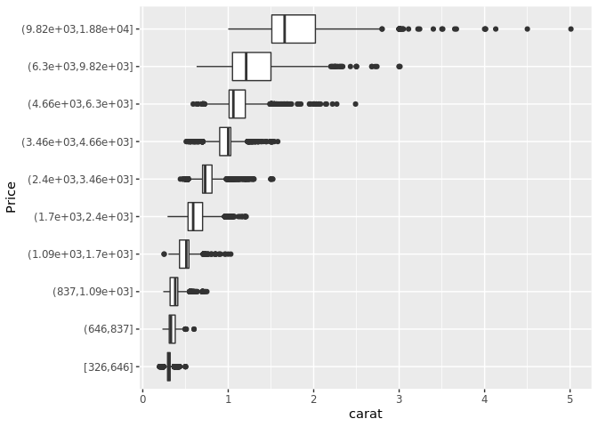
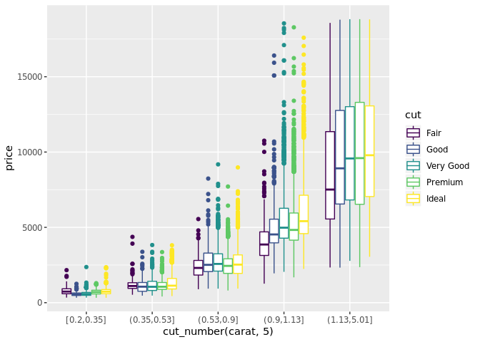

Chapter 7 Workthrough
================
Brianna Cabrera

``` r
library(tidyverse)
```

    ## ── Attaching packages ─────── tidyverse 1.2.1 ──

    ## ✔ ggplot2 3.2.1     ✔ purrr   0.2.5
    ## ✔ tibble  2.1.3     ✔ dplyr   0.8.3
    ## ✔ tidyr   0.8.3     ✔ stringr 1.4.0
    ## ✔ readr   1.1.1     ✔ forcats 0.3.0

    ## ── Conflicts ────────── tidyverse_conflicts() ──
    ## ✖ dplyr::filter() masks stats::filter()
    ## ✖ dplyr::lag()    masks stats::lag()

7.3.4 Exercises
---------------

### 1

``` r
?diamonds
diamonds
```

    ## # A tibble: 53,940 x 10
    ##    carat cut       color clarity depth table price     x     y     z
    ##    <dbl> <ord>     <ord> <ord>   <dbl> <dbl> <int> <dbl> <dbl> <dbl>
    ##  1 0.23  Ideal     E     SI2      61.5    55   326  3.95  3.98  2.43
    ##  2 0.21  Premium   E     SI1      59.8    61   326  3.89  3.84  2.31
    ##  3 0.23  Good      E     VS1      56.9    65   327  4.05  4.07  2.31
    ##  4 0.290 Premium   I     VS2      62.4    58   334  4.2   4.23  2.63
    ##  5 0.31  Good      J     SI2      63.3    58   335  4.34  4.35  2.75
    ##  6 0.24  Very Good J     VVS2     62.8    57   336  3.94  3.96  2.48
    ##  7 0.24  Very Good I     VVS1     62.3    57   336  3.95  3.98  2.47
    ##  8 0.26  Very Good H     SI1      61.9    55   337  4.07  4.11  2.53
    ##  9 0.22  Fair      E     VS2      65.1    61   337  3.87  3.78  2.49
    ## 10 0.23  Very Good H     VS1      59.4    61   338  4     4.05  2.39
    ## # … with 53,930 more rows

The x variable is the length in nm, the y variable is the width in nm, and the z variable is the depth in nm. These are all measurments of diamonds.

### 2

``` r
ggplot(diamonds) +
  geom_histogram(mapping = aes(x = price))
```

    ## `stat_bin()` using `bins = 30`. Pick better value with `binwidth`.

 There were not many low price diamonds which is not surprising as diamonds are usually expensive.

### 3

``` r
count(filter(diamonds, carat == 0.99))
```

    ## # A tibble: 1 x 1
    ##       n
    ##   <int>
    ## 1    23

There 23 diamonds that have exactly 0.99 carats.

``` r
count(filter(diamonds, carat == 1))
```

    ## # A tibble: 1 x 1
    ##       n
    ##   <int>
    ## 1  1558

I think the cause in the difference is due to cut.

### 4

``` r
ggplot(diamonds) + 
  geom_histogram(mapping = aes(x = y), binwidth = 0.5) +
  coord_cartesian(ylim = c(0, 50))
```



``` r
ggplot(diamonds) + 
  geom_histogram(mapping = aes(x = y), binwidth = 0.5) +
  coord_cartesian(xlim = c(0, 50))
```



``` r
ggplot(diamonds) + 
  geom_histogram(mapping = aes(x = y)) +
  coord_cartesian(ylim = c(0, 50))
```

    ## `stat_bin()` using `bins = 30`. Pick better value with `binwidth`.

 The binwidth is automatically set at default when it is not set.

7.4.1 Exercises
---------------

### 1

Missing values are removed and a warning message appears on screen when a histogram has missing values. In a bar chart, the missing values are treated like another catgory.

### 2

``` r
?mean
```

`na.rm = TRUE` in `mean()` and `sum()` indicates whether the missing values should be included or not.

7.5.1.1 Exercises
-----------------

### 1

``` r
nycflights13::flights %>%
  mutate(
    cancelled = is.na(dep_time),
    sched_hour = sched_dep_time %/% 100,
    sched_min = sched_dep_time %% 100,
    sched_dep_time = sched_hour + sched_min / 60
  ) %>%
  ggplot() +
  geom_boxplot(mapping = aes(y = sched_dep_time, x = cancelled))
```



### 2

The variable most important in the diamonds dataset is most important for predicting the price of a diamond.

``` r
ggplot(diamonds, aes(x = cut, y = carat)) + 
  geom_boxplot()
```

 A larger diamond can be sold even when it has a lower quality cut and vice versa.

### 3

``` r
#install.packages("ggstance")
library(ggstance)
```

    ## 
    ## Attaching package: 'ggstance'

    ## The following objects are masked from 'package:ggplot2':
    ## 
    ##     geom_errorbarh, GeomErrorbarh

``` r
ggplot(data = mpg) +
  geom_boxploth(mapping = aes(y = reorder(class, hwy, FUN = median), x = hwy))
```

 The outputs are the same but the inputs are different.

### 4

Not sure how to use this code.

### 5

``` r
?geom_violin
```

A compact display of a continuous distribution. It's a mix of a boxplot and a density plot. Violin plots show the probability density of data at differnt values.

### 6

``` r
#install.packages("ggbeeswarm")
??ggbeeswarm
```

7.5.2.1 Exercises
-----------------

### 1

``` r
?geom_tile
```

### 2

``` r
#install.packages("diplyr")
#library(diplyr)
```

### 3

Can't do number 2 so can't answer \#3

7.5.3.1 Exercises
-----------------

### 1

``` r
?cut_width
```

Both split variables into groups.

To use these commands, we need to specify the number of groups made with can change the way the graph looks

### 2

``` r
ggplot(diamonds, aes(x = cut_number(price, 10), y = carat)) +
  geom_boxplot() +
  coord_flip() +
  xlab("Price")
```



### 3

The distribution of very large diamonds is more variable which is not surprising. Very large diamonds tend to get sold regardless of the cut and clarity and color.

### 4

``` r
ggplot(diamonds, aes(x = cut_number(carat, 5), y = price, colour = cut)) +
  geom_boxplot()
```



### 5

A scatterplot is able to show more values and emphasizes the trend while showing outliers.
